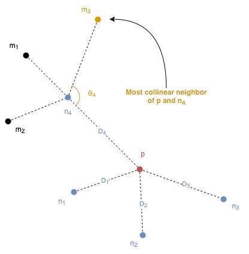
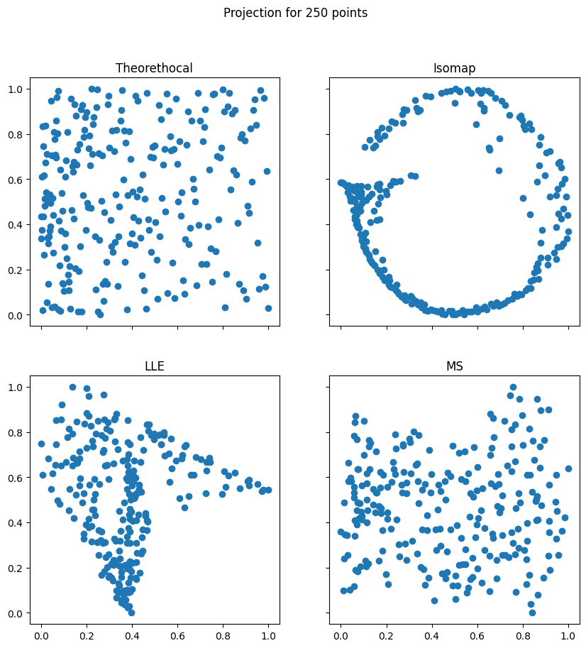
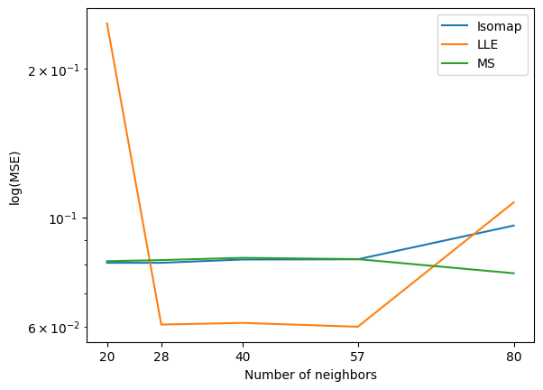
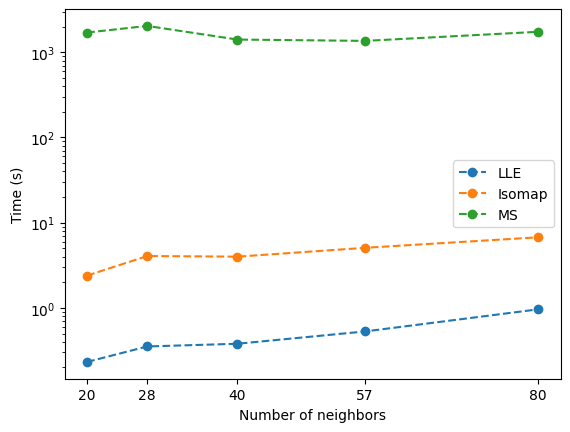
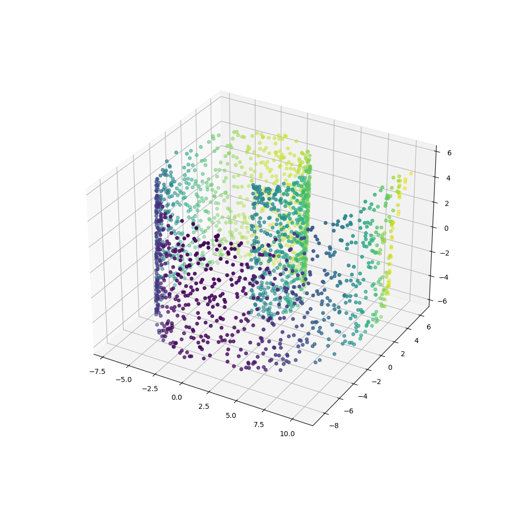

# Manifold Sculpting

## Overview
An implementation of Manifold Sculpting algorithm as introduced in
[Iterative Non-linear Dimensionality Reduction by Manifold Sculpting (Gashler et al., 2007)](https://proceedings.neurips.cc/paper/2007/file/c06d06da9666a219db15cf575aff2824-Paper.pdf).

Manifold Sculpting is a nonlinear dimensionality reduction technique that preserves distances and angles between neighbor points, by using the loss

$$
L(p_i) = \sum_{j = 1}^{k} \omega_i \left(\left(\frac{d_{ij}^0 - d_{ij}}{2 d_{avg}}\right)^2 + \left(\frac{\theta_{ij}^0 - \theta_{ij}}{\pi}\right)^2\right)
$$



The algorithm is: 
1. Compute relationship between neighbors
2. Optionally perform PCA
3. Until the stopping criterion is met
1. Scale up dimensions to preserve by σ
2. Scale down dimensions to scale by σ
3. Adjust preserved dimensions by shifting the points
4. Drop dimensions to scale


## Usage

The required Python packages are listed in `requirements.txt`, use 
```
pip install -r requirements.txt
```
to install them.  
All the codes can be compiled using the makefile command `make <command>` from the base directory. The avalilable commands are:
 - `config`: create th Json file holding the necessary paths
 - `gendata`: generate datasets of required shapes
 - `run`: run the manifold sculpting algorithm and save the results
 - `gif`: create a gif using the checkpoints saved while running the manifold sculpting algorithm.

 ## Results
 
 To validate the dataset and test its efficiency againts the theorethical result and against other methods.

### Pro
 - Accurate even with a small density of points (250 in the picture) 
 - Number of neighbors is not that influential on the result 

### Cons

- Slow 
- Many hyperparameters to choose 
- Must be rotated to align with the XY plane

The full process can be appreciated in the following gif: 