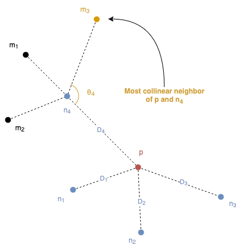
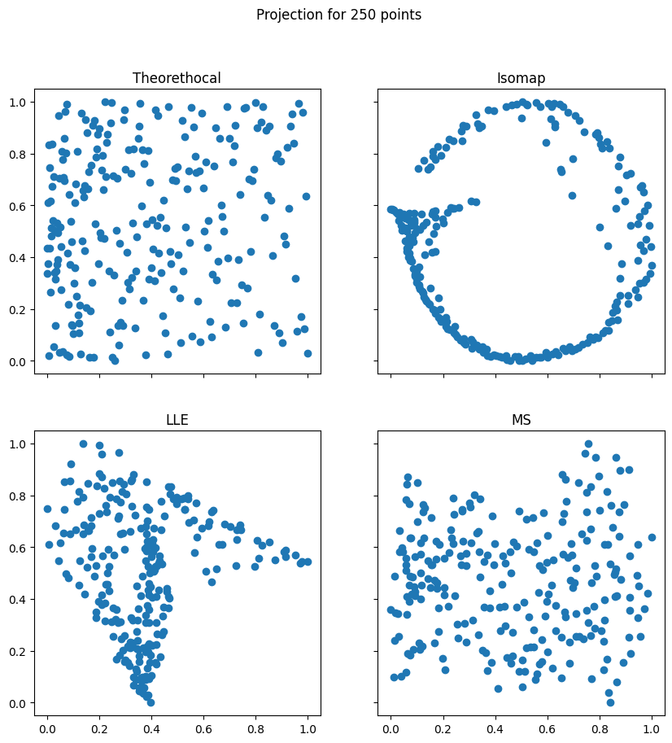
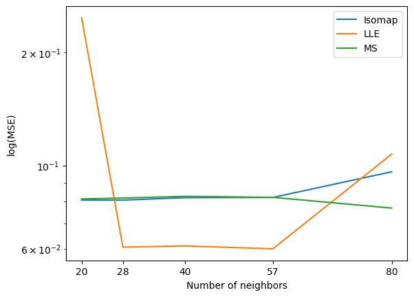
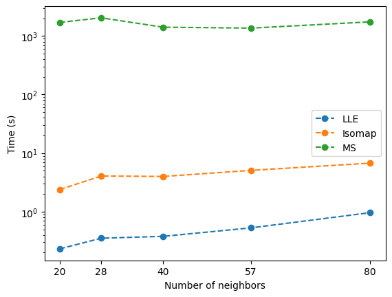
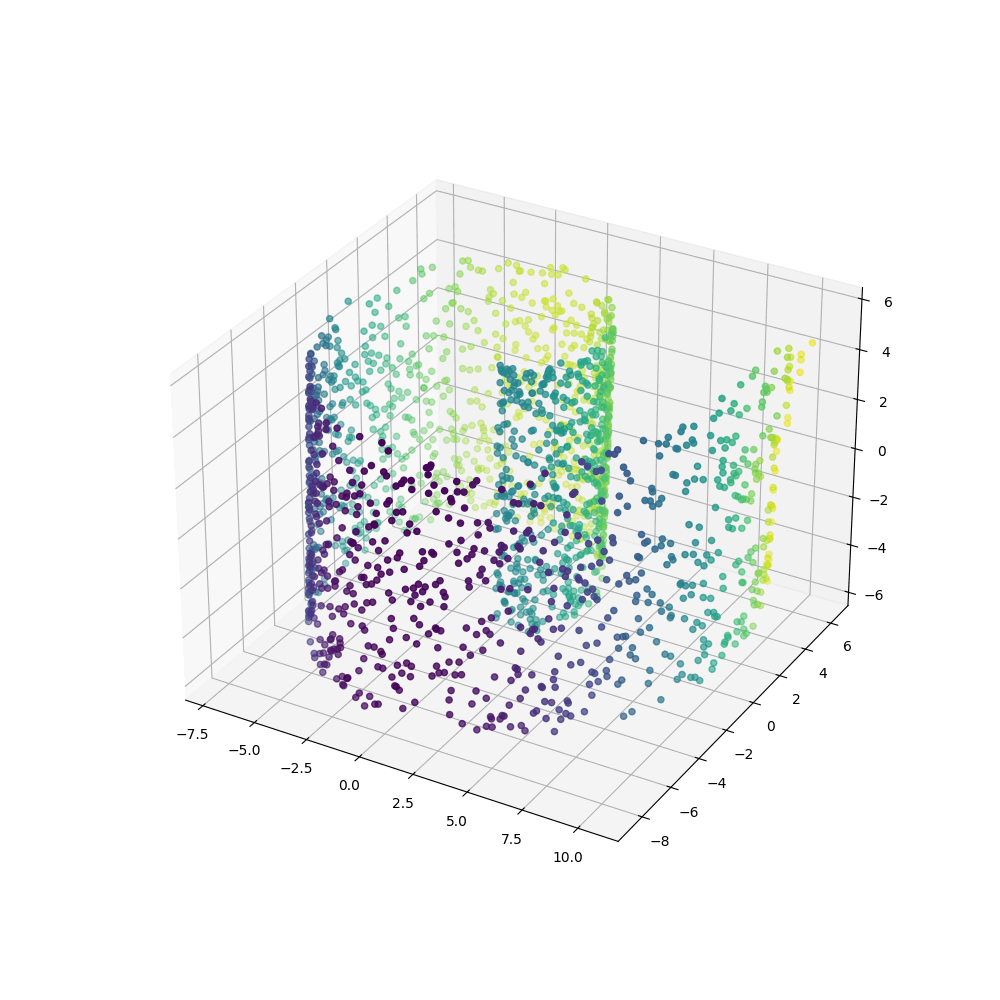

# Manifold Sculpting

## Overview

This is my implementation of Manifold Sculpting algorithm, as introduced in the paper
[Iterative Non-linear Dimensionality Reduction by Manifold Sculpting (Gashler et al., 2007)](https://proceedings.neurips.cc/paper/2007/file/c06d06da9666a219db15cf575aff2824-Paper.pdf).

Manifold Sculpting is a nonlinear dimensionality reduction technique that preserves distances and angles between neighbor points, by using the loss function:

$$
L(p_i) = \sum_{j = 1}^{k} \omega_i \left(\left(\frac{d_{ij}^0 - d_{ij}}{2 d_{avg}}\right)^2 + \left(\frac{\theta_{ij}^0 - \theta_{ij}}{\pi}\right)^2\right)
$$



The algorithm is:

1. Compute relationship between neighbors
2. Optionally perform PCA
3. Until the stopping criterion is met:
    1. Scale up dimensions to preserve by σ
    2. Scale down dimensions to scale by σ
    3. Adjust preserved dimensions by shifting the points
    4. Drop dimensions to scale

## Usage

The Setup is made using Docker. To create the container and install the needed python packages use:

```bash
docker build -t mycontainer .
```

the `src/run.py` creates a dataset with `N` points, runs the manifold sculpting algorithm, saves an image for each checkpoint and uses them to create a GIF of the process. The possible parameters, to change inside `src/run.py` are:

- `N`: number of points in the dataset
- `n_neighbors`: number of neighbors for the manifold sculpting algorithm
- `n_components`: number of final dimensions of the space
- `max_iter_no_change`: maximum number of iterations without a change in the mean error after which the algorithm is stopped.
- `n_iterations`: total number of iterations for the algorithm
- `save_every`: every how many iterations a checkpoint is saved
- `generate_gif_flag`: whether to save images at checkpoints and generate gifs or not

The container can be run with:

```bash
docker run --rm -v $(pwd)/data/:/app/data/ mycontainer
```

where `-v $(pwd)/data/:/app/data/` is used to ensure that outputs are saved in the `./data/` folder and not overwritten.

## Results

To validate the dataset and test its efficiency againts the theorethical result and against other methods.

### Pro

- Accurate even with a small density of points (250 in the picture) 
- Number of neighbors is not that influential on the result 

### Cons

- Slow 
- Many hyperparameters to choose
- Must be rotated to align with the XY plane

The full process can be appreciated in the following gif: .
